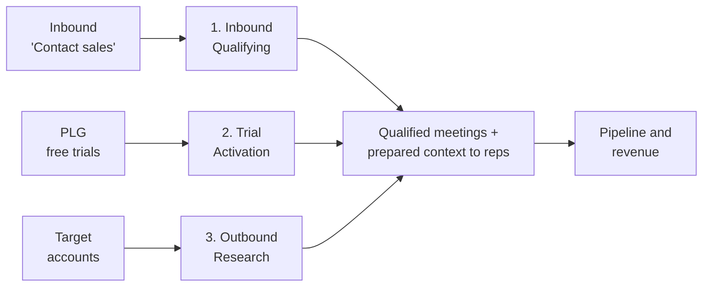

# Top-of-Funnel AI Use Cases — An AI-Native GTM Playbook

A build-ready, **anonymized** reference for a **Revenue Engineering team** and a **business
process leader** to replicate a production **AI-native go-to-market (GTM)** system.

It is drawn from a real deployment at a **$1B+ ARR, publicly traded B2B SaaS company** (growing
~24% YoY, 1,000+ GTM employees, ~60% of the Fortune 500 as customers) and generalized so any
team can build and evaluate it. Company, author, and product names have been removed; vendor
names are kept as a **swappable reference stack**.

---

## What's inside

Three production AI agents — one per funnel stage — plus the architecture, lessons, metrics, and
rollout plan to build them:

| Workflow | What it does | Flagship result |
|----------|--------------|-----------------|
| **1. Inbound Qualifying & Hand-off Agent** | Voice-qualifies inbound "contact sales" requests (BANT) and hands reps a prepared, qualified meeting | ~24 h → **< 2 min** response; **100%** inbound coverage |
| **2. In-Platform Trial Activation Agent** | Live in-app "personal sales engineer" that detects intent and routes trial users to value | **2.5×** conversion vs. control |
| **3. Outbound Research & Account Planning Agent** | Deep account research, plans, and cadences at scale | **1–2 weeks → ~5 min** |

---

## Read the playbook

Start with the overview, then go deep per section:

1. **[00 — Overview](docs/00-overview.md)** — results, philosophy, the three workflows, how to use this
2. **[01 — Inbound Qualifying & Hand-off Agent](docs/01-inbound-qualifying-agent.md)** — voice qualifier (flows + architecture)
3. **[02 — In-Platform Trial Activation Agent](docs/02-trial-activation-agent.md)** — PLG in-app agent
4. **[03 — Outbound Research & Account Planning Agent](docs/03-outbound-research-agent.md)** — orchestrated research
5. **[04 — Architecture Evolution](docs/04-architecture-evolution.md)** — built & rebuilt 4× + the target architecture
6. **[05 — Build Lessons](docs/05-build-lessons.md)** — stack, 60% readiness, change management
7. **[06 — Metrics & Evaluation](docs/06-metrics-and-evaluation.md)** — KPIs, eval/QA harness, guardrails
8. **[07 — Rollout, Build-vs-Buy & Risks](docs/07-rollout-build-vs-buy-risks.md)** — phased plan + risk register
9. **[08 — Reference Stack](docs/08-reference-stack.md)** — swappable tools by layer

**For sharing & execution:**

- **[09 — Executive Summary (1-page)](docs/09-executive-summary.md)** — the pitch, the ask, 90-day success criteria
- **[10 — Build Backlog](docs/10-build-backlog.md)** — epics & stories with acceptance criteria, sized and sequenced

> Diagrams are written in **Mermaid** and render natively on GitHub.

---

## The one idea to remember

**"Smart tools and naive agents."** Push determinism into tools and microservices; reserve the
LLM for genuine reasoning. Deploy at ~60% readiness, evaluate everything, and iterate — this
system was rebuilt four times in under a year to get there.
