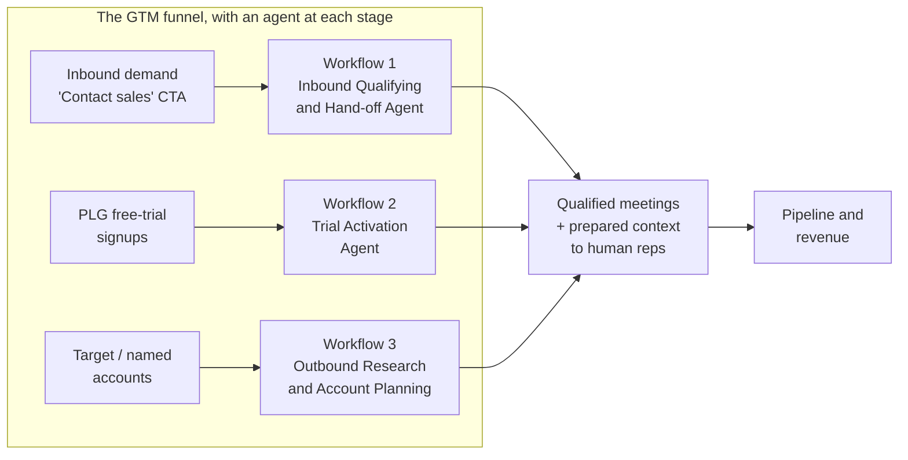

# 00 — Overview: What AI-Native GTM Looks Like at Scale

> **What this is.** A build-ready reference for a Revenue Engineering team and a business
> process leader to replicate a production AI-native go-to-market (GTM) system. It is
> anonymized from a real deployment at a **$1B+ ARR, publicly traded B2B SaaS company**
> growing **~24% year-over-year** with **1,000+ GTM employees** and **~60% of the Fortune 500**
> as customers.

---

## The headline results

In a single year, the AI GTM system:

- Handled **tens of thousands of leads**
- Booked **thousands of meetings**
- Generated **millions of dollars in pipeline**
- Cut demo-request response time from **~24 hours → under 2 minutes**

This is not a prototype. It is AI GTM **in production** at public-company scale, operating
inside intricate routing logic, global rollouts, legacy tech stacks, and real compliance
requirements.

---

## The operating philosophy

Three ideas underpin everything in this playbook:

1. **Reps should only receive qualified meetings — not raw leads.** AI absorbs the admin,
   qualification, research, and meeting prep so humans focus on relationship-building,
   strategy, and complex/enterprise selling.
2. **"Smart tools and naive agents."** Push determinism into tools and microservices; reserve
   the LLM for genuine reasoning. (This is the single most important architectural lesson —
   see [04 — Architecture Evolution](04-architecture-evolution.md).)
3. **Deploy at ~60% readiness and iterate.** The unknowns in an AI implementation are endless;
   continuous iteration is the only path. Optimize simultaneously for **results** and
   **learning**.

---

## The three workflows

The system is built around a dedicated internal AI-for-GTM team (treat it as an "internal
startup" with its own token budget and mandate). It ships three high-impact agents, one per
stage of the funnel:

| # | Workflow | Funnel stage | Core job | Flagship result |
|---|----------|--------------|----------|-----------------|
| 1 | [Inbound Qualifying & Hand-off Agent](01-inbound-qualifying-agent.md) | Inbound / speed-to-lead | Voice-qualify inbound "contact sales" requests (BANT) and hand reps a prepared, qualified meeting | Handles **100%** of English-speaking contact-sales inbound; responds in **~2 min** (was ~24 h) |
| 2 | [In-Platform Trial Activation Agent](02-trial-activation-agent.md) | PLG / free-trial activation | Live in-app "personal sales engineer" that detects intent and routes users to value | **2.5×** conversion vs. control; **3,000+** monthly calls; **50%** return for a 2nd call |
| 3 | [Outbound Research & Account Planning Agent](03-outbound-research-agent.md) | Outbound / enterprise | Deep account research, account plans, and outreach cadences at scale | Work that took **1–2 weeks → ~5 min** |

---

## How to use this playbook

Read in order if you are scoping a program; jump to a workflow if you are scoping a first
build.

1. **[00 — Overview](00-overview.md)** — this file.
2. **[01](01-inbound-qualifying-agent.md) / [02](02-trial-activation-agent.md) /
   [03](03-outbound-research-agent.md)** — the three workflows in build-ready detail
   (purpose, UX, flows, architecture, data, guardrails, metrics).
3. **[04 — Architecture Evolution](04-architecture-evolution.md)** — how the system was
   built and **rebuilt four times**, plus the target reference architecture.
4. **[05 — Build Lessons](05-build-lessons.md)** — the non-obvious organizational and
   technical lessons.
5. **[06 — Metrics & Evaluation](06-metrics-and-evaluation.md)** — KPIs, an eval/QA harness,
   and guardrails.
6. **[07 — Rollout, Build-vs-Buy & Risks](07-rollout-build-vs-buy-risks.md)** — a phased
   rollout plan, a build-vs-buy decision framework, and a risk register.
7. **[08 — Reference Stack](08-reference-stack.md)** — the swappable tool stack by layer.

---

## Who does what

| Role | What they own in this playbook |
|------|--------------------------------|
| **Business process leader** | Funnel design, workflow objectives, success metrics, change management, cohort rollout, build-vs-buy calls |
| **Revenue / GTM engineer** | Orchestration, agent design, smart-tool microservices, integrations, eval harness, observability |
| **RevOps** | CRM as system of record, routing/assignment logic, reporting, data hygiene |
| **Sales leadership** | Defining what a "qualified meeting" means, adoption, trust, feedback loops |

> **Naming note:** In the source deployment each agent had a human persona/name. Giving an
> agent a name and personality is a **deliberate best practice** (it measurably reduces
> voice-call hang-ups). Throughout this playbook we use functional role names; when you build,
> pick your own persona.
