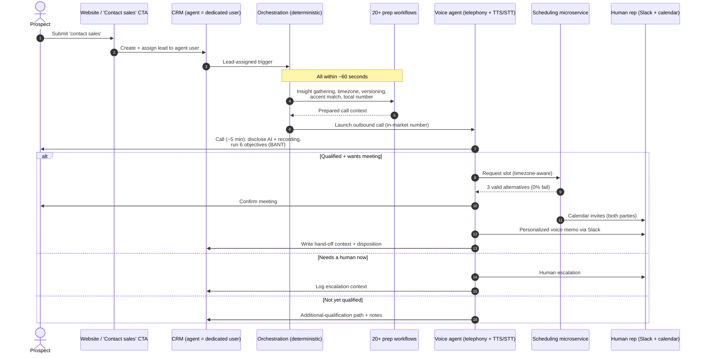
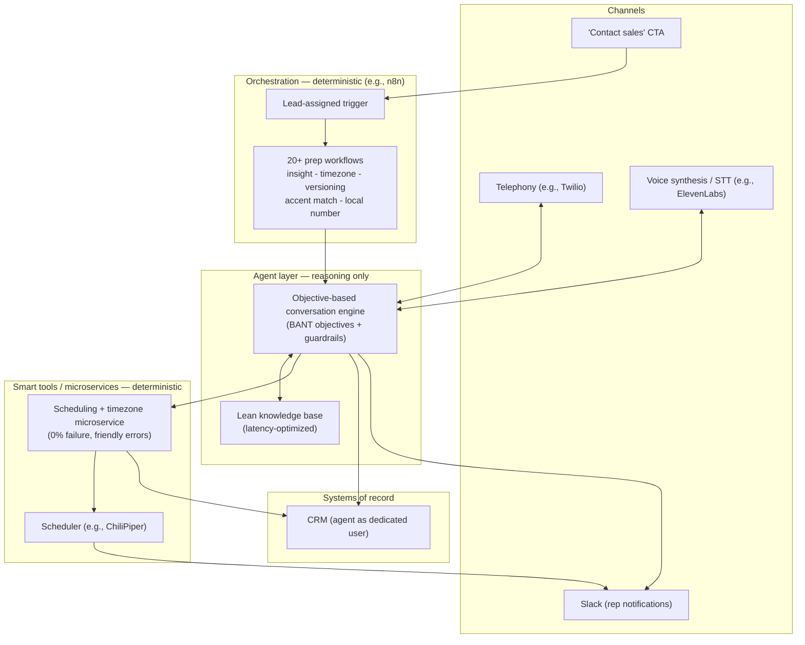

# 01 — Workflow 1: Inbound Qualifying & Hand-off Agent

> **Funnel stage:** Inbound / speed-to-lead
> **Core job:** Voice-qualify inbound "contact sales" requests using BANT, then hand a human
> rep a **qualified meeting with context already prepared** — never a raw lead.
> **Type:** Real-time **voice** agent + deterministic orchestration.

---

## Why this is the wedge

Speed-to-lead is the highest-leverage place to start: **the faster the response, the higher
the conversion to a qualified meeting.** It is measurable, it has an obvious baseline (human
response time), and it is a clean A/B test against manual outreach. Start here.

**Guiding principle:** _Sales reps shouldn't handle leads; they should only receive qualified
meetings with the context already prepared._

---

## Results (anonymized)

| Metric | Before | After |
|--------|--------|-------|
| Response time to inbound "contact sales" | ~24 hours | **under 2 minutes** |
| Coverage of English-speaking contact-sales inbound | partial, human-limited | **100%** |
| Average call length | — | **~5 minutes** |
| Live scheduling failure rate (after microservices) | non-trivial | **0%** |
| Target voice latency (human speech → agent response) | — | **0.6–0.8 seconds** |

Deployed in English-speaking markets **plus** localized markets such as Brazil, France, and
Germany. Rolled out conservatively, A/B tested against manual outreach, then spread organically
across the org beyond its original user base.

---

## How it is set up

- The agent is provisioned as a **dedicated user in the CRM**. It gets **assigned leads** the
  same way a human rep would, so it lives inside existing routing/assignment logic rather than
  bolting on beside it.
- A **`contact sales` CTA submission** is the trigger event.
- Lead assignment kicks off orchestration across **20+ preparation workflows**, all completing
  **within ~60 seconds** of submission:
  - Insight gathering (who is this lead / account)
  - Timezone resolution (where are they, is it callable hours)
  - Agent **versioning** (which agent config/version to run)
  - **Accent matching** (match voice to market)
  - **Local phone number** selection (dial from an in-market number)
- Then the agent places an **outbound voice call**, averaging ~5 minutes.

---

## The call: design nuances that matter

These details are what make the difference between a call that converts and a call that gets
hung up on:

1. **Disclose AI + recording, with personality.** The agent clearly states it is AI and that
   the call is recorded. Injecting a little humor into the disclosure builds rapport instead of
   friction. The opening line and the recording disclosure were **tested rigorously to minimize
   hang-up rates**.
2. **Objective-based, not scripted.** The conversation is dynamic, with **guardrails** for
   acceptable/unacceptable statements — but it is driven by objectives, not a script. The six
   objectives (a BANT-style qualification):
   - **(a) Understand intent** — support vs. commercial interest
   - **(b) Identify the pain point**
   - **(c) Assess needs**
   - **(d) Verify buying authority**
   - **(e) Clarify the use case**
   - **(f) Schedule the meeting** with sales
3. **Latency is a first-class constraint.** Target **0.6–0.8s** between the human finishing
   speaking and the agent responding. To hit this, keep the **knowledge base lean** — a big KB
   slows retrieval and breaks the conversational feel. Latency also constrains model choice (the
   most capable model isn't always fast enough for voice).
4. **Multiple sub-funnels after the call:**
   - Human escalation
   - Successful demo scheduling
   - Additional qualification paths
5. **Scheduling + hand-off:**
   - **Scheduling integration** books the meeting with automated calendar invites for **both
     parties**.
   - A **personalized voice memo** for the assigned rep is generated and shared via **Slack**
     (a small human touch that also drives rep adoption).
   - The CRM is updated with **all relevant hand-off context**.

---

## End-to-end flow (sequence)

---

## Component architecture

> **Why the scheduling microservice matters:** booking a meeting live, on a voice call, across
> global timezones is exactly where naive LLM agents hallucinate. A deterministic microservice
> converts timezones, refreshes available slots, and returns **friendly** responses ("that time
> isn't available, here are three alternatives") instead of raw errors ("Error 153"). This
> single change took live scheduling to a **0% failure rate** and was critical for building
> organizational trust. See [04](04-architecture-evolution.md).

---

## Data & context contract (what to design)

| Stage | Inputs | Outputs written back |
|-------|--------|----------------------|
| Trigger | CTA form fields, lead/account identifiers | CRM lead assigned to agent user |
| Prep (≤60s) | Enrichment/insight sources, timezone, market config | Prepared call context, chosen agent version, accent, local number |
| Call | Live transcript, objective state (BANT) | Objective-completion flags, intent (support vs. commercial), disposition |
| Schedule | Rep availability, prospect timezone | Confirmed meeting, dual calendar invites |
| Hand-off | Full call context | CRM notes, rep Slack voice memo, sub-funnel routing |

---

## Guardrails (voice-specific)

- **Consent & disclosure:** always disclose AI and recording; honor call-recording consent laws
  per market.
- **Acceptable/unacceptable statement lists** bound the dynamic conversation.
- **Latency budget (0.6–0.8s)** is a hard constraint; keep the KB lean and pre-warm context in
  the 60s prep window.
- **Escalation path** to a human is always available.
- **Localization:** accent matching, local numbers, and callable-hours checks per region.

See the full harness in [06 — Metrics & Evaluation](06-metrics-and-evaluation.md).

---

## KPIs for this workflow

- Speed-to-lead (median response time) — target: **< 2 min**
- % of inbound handled — target: **100%** of in-scope language/market
- Connect rate / hang-up rate (optimize opening line)
- Objective-completion rate (per BANT objective)
- Qualified-meeting conversion rate; meeting show rate
- Live scheduling failure rate — target: **0%**
- Voice latency — target: **0.6–0.8s**
- Pipeline generated / influenced

---

## Minimum viable build (start here)

1. Provision the agent as a **CRM user** and route a **single market / language** to it.
2. Wire the **CTA → CRM assignment → orchestration** trigger.
3. Build the **≤60s prep** as deterministic workflows (start with insight + timezone + local
   number).
4. Stand up the **voice loop** (telephony + STT/TTS + objective engine) with a **lean KB**.
5. Add the **deterministic scheduling microservice** before you scale geographies.
6. Close the loop: **CRM write-back + Slack voice memo** to the rep.
7. **A/B test vs. manual outreach**; expand by cohort and market.

**Next:** [02 — In-Platform Trial Activation Agent](02-trial-activation-agent.md)
