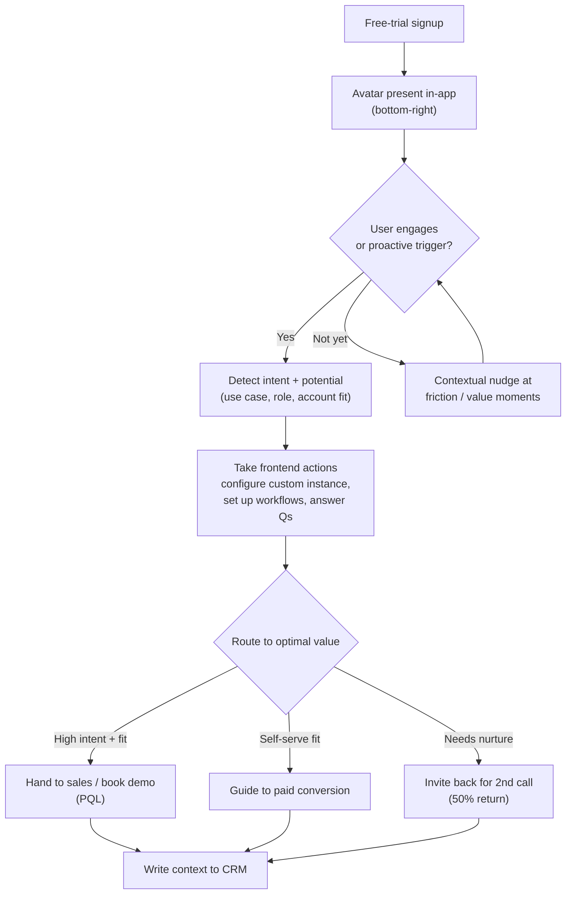
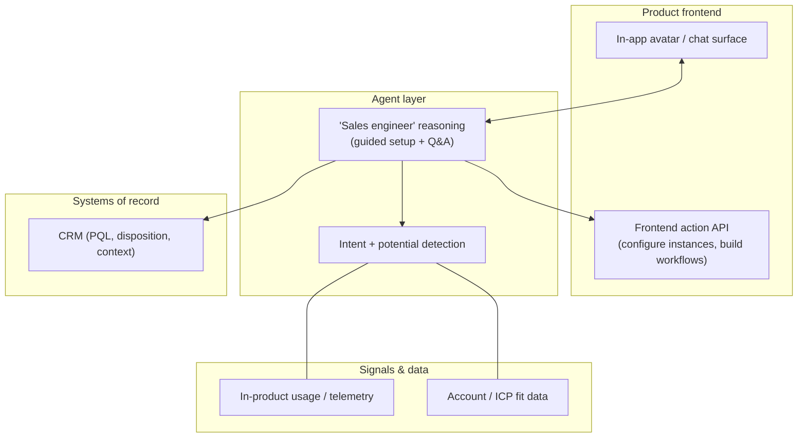

# 02 — Workflow 2: In-Platform Trial Activation Agent

> **Funnel stage:** Product-led growth (PLG) / free-trial activation
> **Core job:** Live, in-product "personal sales engineer" that detects a trial user's intent
> and potential, **takes actions in the product on their behalf**, and routes them to the most
> valuable next step.
> **Type:** In-app conversational agent with **frontend action-taking** ability.

---

## The opportunity

A PLG motion produces a **large volume of free-trial signups**. Most never talk to a human, and
self-serve users routinely stall before reaching value. This agent gives every trial user a
live, on-demand sales engineer — at effectively zero marginal cost per conversation.

---

## Results (anonymized)

| Metric | Result |
|--------|--------|
| Conversion to paid (agent users vs. control) | **2.5×** |
| Monthly live calls/conversations | **3,000+** |
| Users returning for a **second** call | **50%** |
| Qualitative signal | Users **miss the agent when the trial ends** — rare for a sales-automation tool |

---

## The experience (UX)

- Appears as an **avatar in the bottom-right corner** of the app during the free trial.
- Acts as a **personal sales engineer**, available to **talk live at any point** during the
  trial.
- Can **take actions on the product frontend** to configure custom instances for the user
  (not just answer questions — it *does* the setup).
- Detects **intent and potential**, then routes the user to the **most optimal value**:
  self-serve activation, guided configuration, a human/sales conversation, or a demo.

---

## Component architecture

> **Design note — action-taking is the differentiator.** Chatbots answer questions; this agent
> *configures the product for the user*. The hard engineering is a **safe frontend action API**
> the agent can call (with guardrails and undo), not the conversation itself.

---

## Data & context contract

| Element | Inputs | Outputs |
|---------|--------|---------|
| Intent detection | In-product usage/telemetry, stated goals, role | Intent + potential score, recommended path |
| Guided setup | Product capabilities, user's use case | Configured instance / workflows on the frontend |
| Routing | Fit + intent + engagement | PQL to sales, self-serve conversion, or return-nurture |
| Hand-off | Conversation + actions taken | CRM context, PQL flag, next best action |

---

## Guardrails

- **Scope of action:** explicitly bound what the agent may change in a user's instance; provide
  **undo / confirmation** for destructive or high-impact actions.
- **Escalation:** always offer a human path for high-value or stuck users.
- **Privacy:** operate on the user's own trial data only; respect data-use boundaries.
- **No dark patterns:** route to genuine value; measure against a **holdout/control** so you can
  prove lift rather than assume it.

---

## KPIs for this workflow

- Trial-to-paid conversion **vs. control** — target: sustain **~2.5×**
- Conversation volume and **return-call rate** (2nd-call %)
- Activation-milestone completion (did the user reach value?)
- PQL rate and PQL→opportunity conversion
- Expansion / seats configured during trial
- Qualitative: satisfaction, "miss it when it's gone" sentiment

---

## Minimum viable build (start here)

1. Ship the **in-app avatar** to a **cohort** of trials (not 100%) with a **holdout control**.
2. Start with **Q&A + intent detection**; instrument in-product usage signals.
3. Add a **narrow, safe frontend action** (one high-value setup task) with confirmation/undo.
4. Add **routing** to the three paths (sales/PQL, self-serve, return-nurture).
5. Write **PQL + context to CRM**; measure conversion vs. the holdout.
6. Expand action scope and cohorts as reliability proves out.

**Next:** [03 — Outbound Research & Account Planning Agent](03-outbound-research-agent.md)
