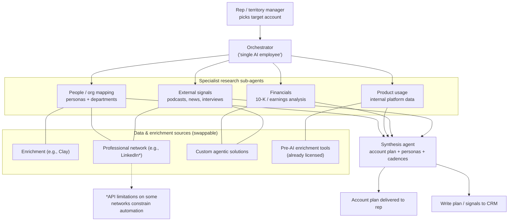
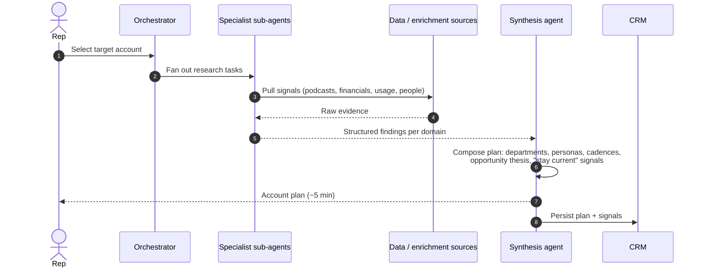

# 03 — Workflow 3: Outbound Research & Account Planning Agent

> **Funnel stage:** Outbound / enterprise
> **Core job:** Deep account research, **account plans**, and outreach **cadences** at scale —
> so reps and territory managers can go deeper on strategy instead of spending days on manual
> research.
> **Type:** **Orchestrated multi-agent** research pipeline, presented to reps as a single "AI
> employee."

---

## The opportunity

In an enterprise motion (here, ~60% of the Fortune 500 are customers), the expensive bottleneck
is **account strategy**: knowing where the real opportunities are, staying current on named
accounts, and not missing buying signals inside a large company. That work traditionally takes a
rep **1–2 weeks** per account.

---

## Result (anonymized)

| Metric | Before | After |
|--------|--------|-------|
| Time to produce deep research + account plan + cadence | **1–2 weeks** | **~5 minutes** |

> Note on measurement: the source team was still building better visibility into "time saved" /
> productivity and translating it into ARR. **Treat time-saved as a leading indicator** and tie
> it to opportunities created/influenced (see KPIs below).

---

## What it produces

For a target account, the agent assembles a strategy-grade **account plan**, including:

- **Deep research** synthesized from many sources, e.g.:
  - Podcast/interview listening (what leaders are saying)
  - Financial-report analysis (10-Ks/earnings, priorities, risks)
  - **Internal platform usage data** (how this account already uses your product)
- **Target departments** and **personas** to pursue
- **Suggested outreach cadences** per persona
- Guidance on **where the right opportunities are**, how to **stay current**, and how not to
  **miss signals** that can be turned into opportunities

---

## Architecture: "single AI employee," actually orchestrated agents

The agent is presented to reps as **one** AI teammate, but under the hood it is a **set of
orchestrated agents** connected to enrichment and data sources — including pre-AI enrichment
tools the team **already licensed** (reuse what you have).

> **Reality check:** some data sources (e.g., certain professional-network APIs) have
> **frustrating API limitations**. Design the pipeline so each source is a **swappable module**
> and the synthesis layer degrades gracefully when one source is thin.

---

## Flow (from trigger to plan)

---

## Data & context contract

| Sub-agent | Inputs | Output into the plan |
|-----------|--------|----------------------|
| External signals | Podcasts, interviews, news | Strategic priorities, timing triggers |
| Financials | Earnings/10-K filings | Business priorities, risks, budget signals |
| Product usage | Internal platform telemetry for the account | Expansion/land opportunities, champions |
| People/org | Enrichment + professional network | Target departments, personas, contacts |
| Synthesis | All of the above | Account plan + persona-level cadences + opportunity thesis |

---

## Guardrails

- **Source attribution:** keep citations/evidence for each claim so reps can trust and verify
  the plan.
- **Freshness:** timestamp signals; flag stale inputs ("stay current" is a core value prop).
- **Compliance:** respect each data source's terms/API limits; don't scrape around hard limits.
- **Human ownership:** the plan is a **draft strategy** for the rep to own and adjust — not an
  auto-send outreach machine (cadences are *suggested*).

---

## KPIs for this workflow

- Time-to-account-plan — target: **minutes, not weeks**
- Rep hours saved per account (leading indicator → tie to ARR)
- Plan **quality score** (rep-rated usefulness / accuracy)
- Cadence acceptance rate (how often reps use the suggested cadence)
- Opportunities **created or influenced** from planned accounts
- Signal coverage (share of named accounts with a fresh plan)

---

## Minimum viable build (start here)

1. Start with **one or two data sources you already license** + one external signal source.
2. Build **one synthesis output**: a structured account plan template (departments, personas,
   cadence, opportunity thesis) with **citations**.
3. Present it as **one** agent to the rep; keep the orchestration hidden.
4. Add sub-agents/sources incrementally; make each a **swappable module**.
5. Have reps **rate plan quality**; feed ratings into your eval loop
   ([06](06-metrics-and-evaluation.md)).
6. Persist plans + signals to the CRM and connect to opportunity outcomes.

**Next:** [04 — Architecture Evolution](04-architecture-evolution.md)
