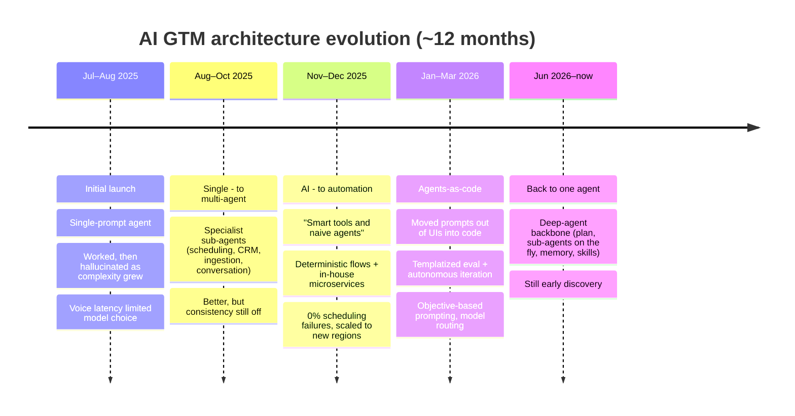
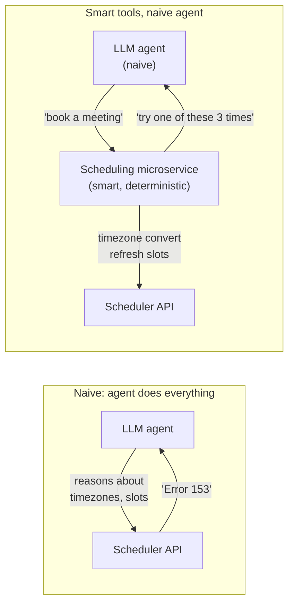
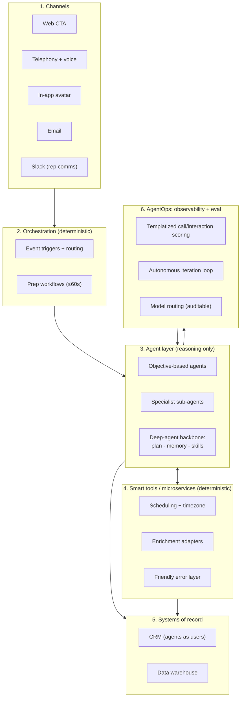

# 04 — Architecture Evolution: Built and Rebuilt Four Times

> The single most valuable part of this playbook. A dedicated AI-for-GTM team ran as an
> **internal startup** and **rebuilt the agent architecture at least four times in under a
> year.** Each rebuild encodes a lesson you can adopt without paying for the mistake.

---

## The journey at a glance

---

## Phase 1 — Initial launch (single-prompt agent)

- The first agent shipped as a **single prompt**.
- It **worked initially, then began hallucinating as complexity scaled**.
- **Voice latency constraints** limited the use of the most capable models — you cannot always
  use the smartest model when you need sub-second responses.

**Lesson:** a single mega-prompt is a great way to *start* and a terrible way to *scale*.

---

## Phase 2 — Single agent → multi-agent

- Moved to **multi-agent orchestration** with **specialist sub-agents** handling discrete tasks:
  **scheduling, CRM updates, lead ingestion, and the conversation itself.**
- **Performance improved, but consistency was still off.**

**Lesson:** decomposition helps, but more agents also means more places for non-determinism to
creep in. Splitting the work isn't sufficient on its own.

---

## Phase 3 — From AI to automation (the pivotal decision)

The most important architectural decision: **strip out AI reasoning wherever possible.**

- New concept: **"smart tools and naive agents."**
- **Deterministic flows** were added everywhere they could get away with it (via an orchestration
  tool such as **n8n**); the LLM was used **only where reasoning was truly required.**
- Added **in-house microservices** to stop hallucinations when scheduling meetings live on calls.
  The scheduling microservice:
  - Converted **timezones** based on where the prospect is
  - Refreshed **available slots** accordingly
  - Booked meetings with a **0% scheduling failure rate**
  - **Simplified agent responses**: instead of a raw "Error 153," the agent receives "that time
    isn't available, here are three alternatives."
- This was **critical for organizational trust and operational stability** — and it was faster.
- It unlocked scaling to **new regions (e.g., ANZ and EMEA)**, which introduced new timezone and
  localization challenges.

**Lesson (adopt this one first):** every task that *can* be deterministic *should* be. Reserve
the LLM for genuine reasoning. Deterministic microservices give you reliability, speed, trust,
and clean error semantics.

---

## Phase 4 — Modernizing development (agents-as-code)

- Moved from **UI-based prompt writing** to **agents-as-code** using an AI-native IDE and coding
  assistant (e.g., Cursor + Claude).
- This enabled **templatized monitoring and evaluation** of the agent's calls, and let **AI
  agents autonomously iterate** on improvements.
- The team worried about becoming **married to a specific model** and not being able to **route
  to different LLMs in an auditable way**. So they shifted **from model-specific, rigid prompts
  to simpler, objective-based prompting.**
- Bonus: objective-based prompting produced a **more natural conversation flow** with prospects.

**Lesson:** treat agents as software (versioned, tested, evaluated in CI) and treat prompts as
**objectives, not scripts** — this keeps you model-portable and auditable.

---

## Phase 5 — Back to a single agent? (early discovery)

- The next evolution (still **early discovery**) is a return to the original vision: **one agent
  that can plan, act, and grow smarter over time.**
- The technology is catching up via a new generation of **agent-harness capabilities** — e.g.,
  agent SDKs (Claude Code SDK), **deep agents**, and **modular skills**.
- A single **deep agent** can now do what previously had to be engineered around: **plan ahead,
  spin up specialist sub-agents on the fly, keep its own working memory across long jobs, and
  reach into a library of skills** (like a senior IC pulling a playbook off the shelf).

**Lesson:** architecture follows capability. Revisit past constraints as agent harnesses mature —
but only after you have the deterministic backbone and eval discipline from Phases 3–4.

---

## The target reference architecture

Bringing the lessons together, here is the layered architecture to build toward:

**Design tenets:**

1. **Deterministic by default, AI by exception** ("smart tools, naive agents").
2. **Agents live inside your systems of record** (provisioned as CRM users).
3. **Objectives over scripts** — keeps you model-portable.
4. **Everything is evaluated** — templatized scoring + autonomous iteration.
5. **Model routing is auditable** — never get married to one model or one vendor.
6. **Latency is an architectural constraint**, not an afterthought (especially voice).

**Next:** [05 — Build Lessons](05-build-lessons.md)
