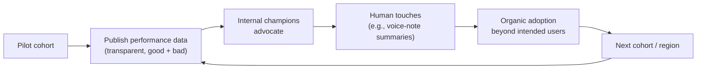

# 05 — Build Lessons

> The non-obvious lessons from running an AI GTM program at scale. The **change-management work
> was as hard as the technical work.**

---

## Lesson 1 — Don't get married to your stack

A production AI GTM system spans **many vendors**, and the list **keeps changing**. A
representative reference stack (all **swappable** — see [08](08-reference-stack.md)):

| Layer | Example vendor |
|-------|----------------|
| Orchestration | n8n |
| CRM / system of record | Salesforce |
| Voice synthesis | ElevenLabs |
| Telephony | Twilio |
| Email | SendGrid |
| Scheduling | ChiliPiper |
| Data / enrichment | Clay |
| LLM | Claude |
| AI coding / agents-as-code | Cursor |

Several of these **weren't in the original build.** **Build-vs-buy becomes a constant decision**,
and **vendor lock-in can hold your whole effort back.** Design for substitution: adapters at
every boundary, auditable model routing, and no single vendor on your critical path that you
can't replace.

---

## Lesson 2 — Deploy at ~60% readiness

- You **will** face real challenges with reliability and hallucinations. The unknown variables in
  an AI implementation are **endless.**
- **Continuous iteration is the only path forward.**
- **Optimize simultaneously for results and learning** — a 60%-ready deployment that teaches you
  something beats a 100%-planned deployment that never ships.
- Pair this with discipline: deterministic backbone (Phase 3) + eval harness
  ([06](06-metrics-and-evaluation.md)) so "60%" is *safe to ship*, not reckless.

---

## Lesson 3 — Over-communicate internally (change management)

The rollout playbook that built trust:

- **Gradual rollouts by cohort** — never big-bang.
- **Cultivate internal AI champions** who advocate within their teams.
- **Be transparent about performance data** for *all* AI agents — wins and misses.
- **Add human touches.** For example, program the inbound agent to send a **funny voice note**
  to a rep summarizing the meeting it just booked. Small delight → adoption.

> In the source deployment, agents **spread organically across the org well beyond their intended
> user base** — a direct result of this change-management work, not just the technology.

---

## Lesson 4 — Point AI at the right work

The intended division of labor:

| AI should own | Humans should own |
|---------------|-------------------|
| Admin work | Relationship-building |
| Qualification | Strategy |
| Research | Complex / enterprise selling |
| Meeting preparation | Judgment calls & negotiation |

**AI eliminates the low-leverage work so reps focus on the high-leverage work.**

---

## Lesson 5 — If your first (or second) attempt didn't pan out, try again

This system was **rebuilt at least four times in under a year**
([04](04-architecture-evolution.md)). Early failure is expected and is *not* evidence that AI GTM
doesn't work — it's evidence you're still iterating toward the right architecture. Treat AI GTM
as a **program**, not a project.

**Next:** [06 — Metrics & Evaluation](06-metrics-and-evaluation.md)
