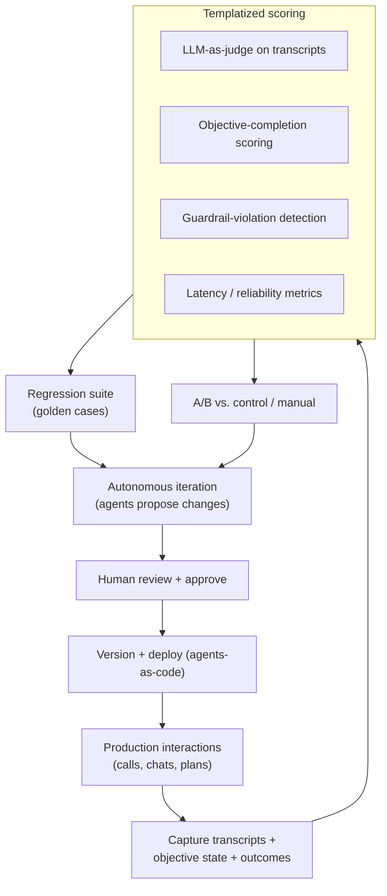

# 06 — Metrics & Evaluation

> How to know it's working — and how to keep it working. This is the scaffolding that makes a
> "60%-ready" deployment ([05](05-build-lessons.md)) safe to ship.

---

## North-star & program metrics

| Metric | Why it matters |
|--------|----------------|
| **Pipeline generated / influenced** | The ultimate GTM outcome |
| **Speed-to-lead** | Leading indicator of inbound conversion |
| **Conversion lift vs. control** | Proves the agent *causes* the gain (holdouts, not vibes) |
| **Rep hours saved** | Leading indicator; translate into ARR capacity over time |
| **Trust / adoption** | Organic spread beyond the intended user base |

---

## KPIs by workflow

### Workflow 1 — Inbound Qualifying (voice)
- Median response time (target **< 2 min**)
- % inbound handled (target **100%** in-scope)
- Connect rate, **hang-up rate** (optimize the opening line)
- Objective-completion rate per BANT objective (intent, pain, needs, authority, use case, meeting)
- Qualified-meeting conversion; meeting show rate
- **Live scheduling failure rate** (target **0%**)
- **Voice latency** (target **0.6–0.8s**)

### Workflow 2 — Trial Activation (in-app)
- Trial-to-paid conversion **vs. holdout** (target ~**2.5×**)
- Conversation volume; **return-call rate** (2nd-call %)
- Activation-milestone completion
- PQL rate; PQL → opportunity
- Seats/instances configured during trial

### Workflow 3 — Outbound Research (account planning)
- Time-to-account-plan (target **minutes**)
- Rep-rated **plan quality** score
- Cadence acceptance rate
- Opportunities **created / influenced** from planned accounts
- Signal freshness / coverage of named accounts

---

## The evaluation & QA harness

Borrowed from Phase 4 ([04](04-architecture-evolution.md)): **templatized monitoring and
evaluation**, with **AI agents autonomously iterating**.

**Harness components to build:**

1. **Templatized scoring** — a fixed rubric applied to every interaction (objective completion,
   tone/guardrails, accuracy, latency).
2. **LLM-as-judge** — score transcripts against the rubric; sample for human review.
3. **Golden regression set** — canonical cases that must never regress; run in CI on every change.
4. **A/B vs. control / manual** — always keep a holdout so lift is provable.
5. **Autonomous iteration loop** — agents propose prompt/flow improvements; humans approve.
6. **Auditable model routing** — evaluate across models so you can switch without lock-in.

---

## Guardrails (cross-workflow)

| Guardrail | Applies to | Notes |
|-----------|-----------|-------|
| AI disclosure + recording consent | Voice (W1) | Disclose AI + recording; honor per-market consent law |
| Acceptable/unacceptable statement lists | W1, W2 | Bound dynamic conversations |
| Human escalation path | All | Always available |
| Action scope + undo/confirm | W2 | Bound frontend actions the agent can take |
| Latency budget | W1 | 0.6–0.8s; keep KB lean |
| Source attribution + freshness | W3 | Cite evidence; timestamp signals |
| PII / data-use boundaries | All | Operate on permitted data only |
| Deterministic microservices for high-stakes steps | All | e.g., scheduling → 0% failure |

---

## Instrumentation checklist

- [ ] Every interaction persisted (transcript, objective state, disposition, outcome)
- [ ] Holdout/control group defined **before** launch
- [ ] Rubric + LLM-as-judge scoring live
- [ ] Golden regression set in CI
- [ ] Guardrail-violation alerts
- [ ] Latency + reliability dashboards
- [ ] CRM write-back verified (no silent data loss)
- [ ] Model-routing evaluation across ≥2 models

**Next:** [07 — Rollout, Build-vs-Buy & Risks](07-rollout-build-vs-buy-risks.md)
