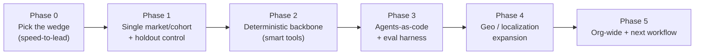
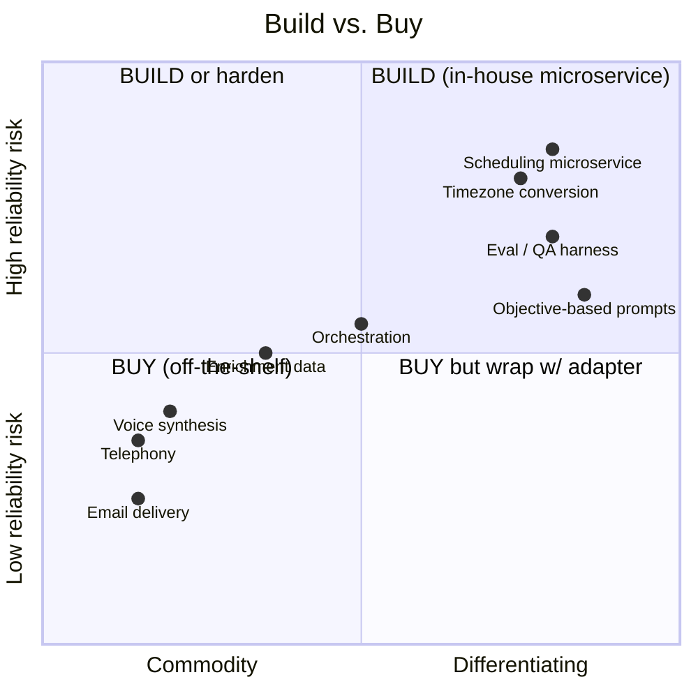

# 07 — Rollout, Build-vs-Buy & Risks

> A phased plan to get from zero to org-wide, a framework for what to build vs. buy, and a risk
> register with mitigations.

---

## Phased rollout plan

| Phase | Goal | Key activities | Exit criteria |
|-------|------|----------------|---------------|
| **0 — Wedge** | Choose one measurable, high-leverage use case | Speed-to-lead is ideal: clear baseline, clean A/B | Sponsor + baseline metrics agreed |
| **1 — Pilot** | Prove lift on a narrow slice | One market/language/cohort; **holdout control**; A/B vs. manual | Statistically meaningful lift; trust from pilot reps |
| **2 — Deterministic backbone** | Reliability & trust | Move high-stakes steps to microservices (e.g., scheduling → 0% failure); friendly errors | Reliability + latency targets met |
| **3 — AgentOps** | Scale safely | Agents-as-code, templatized eval, autonomous iteration, auditable model routing | Eval harness in CI; regression-safe |
| **4 — Localization** | Go global | Timezones, accent matching, local numbers, per-market compliance | New regions (e.g., ANZ/EMEA) live |
| **5 — Expand** | Institutionalize | Cohort expansion, champions, next workflow | Organic adoption; program funded |

> **Sequencing rule:** don't expand geographies (Phase 4) before the deterministic backbone
> (Phase 2). Global timezone/localization is exactly where naive agents break.

---

## Build-vs-buy framework

**Buy** commodities; **build** your differentiation and your reliability-critical glue.

| Decision | Guidance |
|----------|----------|
| **Buy** | Telephony, voice synthesis, email delivery, base scheduling, enrichment data — commodity capabilities with mature vendors |
| **Build** | Deterministic microservices for high-stakes steps (scheduling/timezone), objective-based prompt logic, eval/QA harness, orchestration of *your* funnel |
| **Wrap** | Everything you buy sits behind an **adapter** so it's swappable (avoid lock-in) |
| **Reuse** | Pre-AI enrichment tools you already license — don't re-buy |

---

## Risk register

| # | Risk | Likelihood | Impact | Mitigation |
|---|------|-----------|--------|------------|
| 1 | **Hallucinations** at scale | High | High | "Smart tools, naive agents"; deterministic microservices; guardrails; eval harness |
| 2 | **Voice latency** breaks conversations | High | High | 0.6–0.8s budget; lean KB; latency-appropriate model; pre-warm context in ≤60s prep |
| 3 | **Model lock-in** | Medium | High | Objective-based prompting; auditable model routing; eval across ≥2 models |
| 4 | **Vendor lock-in** | Medium | High | Adapters at every boundary; build-vs-buy discipline; no un-replaceable vendor on critical path |
| 5 | **Compliance** (recording consent, data use, API terms) | Medium | High | Per-market disclosure/consent; respect API limits; PII boundaries; legal review |
| 6 | **Low trust / adoption** | Medium | High | Transparent performance data; champions; human touches; gradual cohorts |
| 7 | **Scheduling failures live on call** | Was high | High | Deterministic scheduling microservice → **0%** failures; friendly alternatives |
| 8 | **Over-engineering AI** where automation suffices | Medium | Medium | Default to deterministic; add AI only where reasoning is required |
| 9 | **Measurement gaps** (esp. "time saved" → ARR) | High | Medium | Holdouts; rep-rated quality; tie leading indicators to opportunities/ARR |
| 10 | **Localization breakage** (timezone/accent) | Medium | Medium | Localization prep workflows; region-by-region rollout after backbone |

---

## Go / no-go checklist before scaling

- [ ] Wedge use case has an agreed baseline and sponsor
- [ ] Holdout/control shows **provable lift**
- [ ] Deterministic backbone handles high-stakes steps (0% critical failures)
- [ ] Eval harness runs in CI with a golden regression set
- [ ] Guardrails + disclosure/consent verified per market
- [ ] Model + vendor routing is swappable and auditable
- [ ] Change-management plan (cohorts, champions, transparent data) in place

**Next:** [08 — Reference Stack](08-reference-stack.md)
