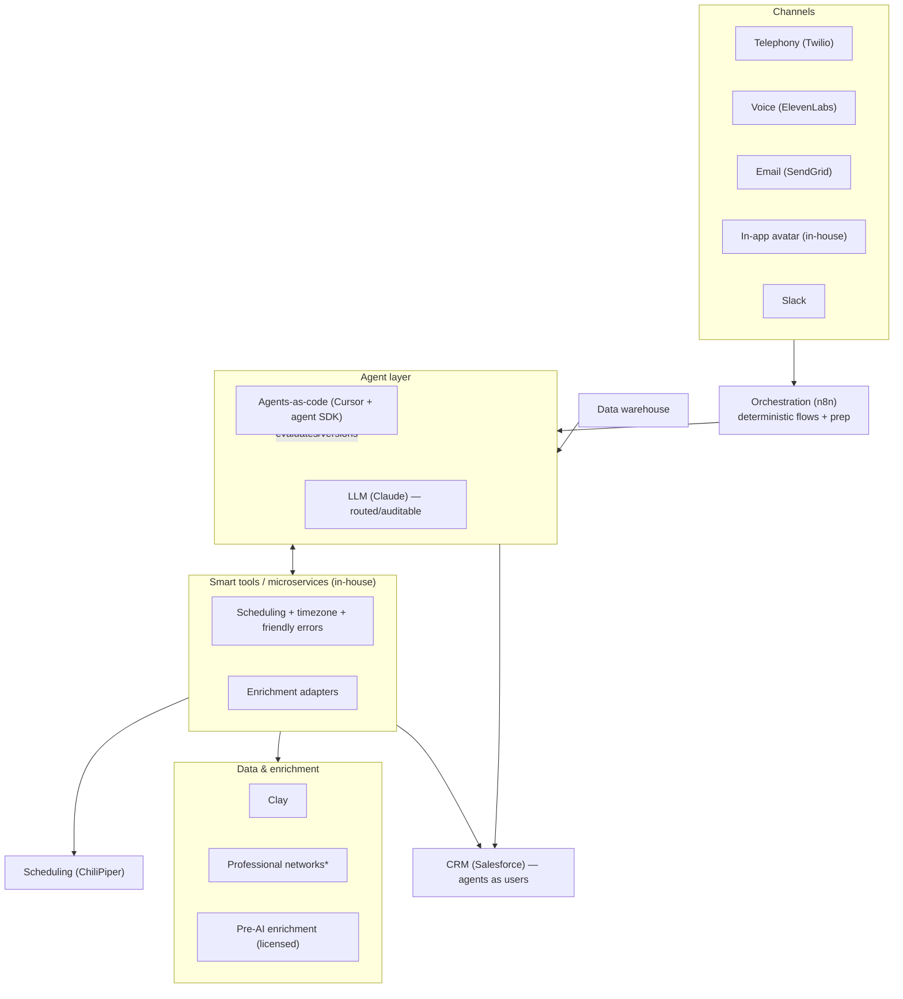
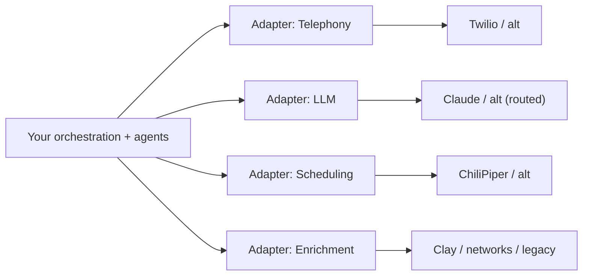

# 08 — Reference Stack (Swappable)

> A concrete, **reference** stack by layer. Every vendor named is an **example** and is meant to
> be **swappable** behind an adapter. The lesson from [05](05-build-lessons.md): *don't get
> married to your stack* — several of these weren't in the original build, and the list keeps
> changing.

---

## Stack by layer

| Layer | Role | Example vendor(s) | Swap notes |
|-------|------|-------------------|------------|
| **Channels — telephony** | Place/receive voice calls | Twilio | Commodity; buy. Wrap in adapter |
| **Channels — voice** | TTS/STT, agent voice | ElevenLabs | Commodity; latency matters for W1 |
| **Channels — email** | Outbound email delivery | SendGrid | Commodity; buy |
| **Channels — in-app** | Trial avatar / chat surface (W2) | In-house frontend | Differentiating; build |
| **Channels — rep comms** | Notify reps (voice memos, summaries) | Slack | Swappable messaging layer |
| **Orchestration** | Deterministic flows, triggers, prep workflows | n8n | Core backbone; keep logic portable |
| **Agent / LLM** | Reasoning, conversation | Claude | Route across models; avoid lock-in |
| **Agents-as-code / AgentOps** | Build, version, eval agents | Cursor + agent SDK (e.g., Claude Code SDK), deep agents, modular skills | Treat agents as software |
| **Smart tools / microservices** | Deterministic high-stakes steps | In-house (scheduling, timezone, friendly-error layer) | Differentiating; build |
| **Scheduling** | Book meetings, dual invites | ChiliPiper | Buy base; wrap with your microservice |
| **Data / enrichment** | Account & contact data | Clay, professional networks*, custom agentic solutions, pre-AI enrichment tools | Reuse licensed tools; modular sources |
| **CRM / system of record** | Assignment, hand-off, reporting | Salesforce | Agents provisioned as **CRM users** |
| **Data warehouse** | Usage/telemetry, measurement | (your warehouse) | Powers intent (W2) + measurement |

\* Some professional-network APIs have **frustrating limitations**; design sources as swappable
modules and let synthesis degrade gracefully.

---

## How the layers connect

---

## Adapter principle (avoid lock-in)

Put an **adapter/interface** between your system and every external vendor:

- No vendor sits on your critical path without a replaceable adapter.
- Model routing is **auditable** — you can prove which model handled what, and switch.
- Build-vs-buy ([07](07-rollout-build-vs-buy-risks.md)) is revisited as vendors and capabilities
  change.

---

## Minimum stack to start (Workflow 1 pilot)

1. Telephony + voice (buy)
2. Orchestration for the ≤60s prep + trigger (n8n or equivalent)
3. One LLM behind an adapter (objective-based prompting)
4. **In-house scheduling/timezone microservice** (build — this is your reliability)
5. Scheduler + CRM (agent as a CRM user)
6. Slack for rep hand-off + an eval harness ([06](06-metrics-and-evaluation.md))

**Back to:** [00 — Overview](00-overview.md)
