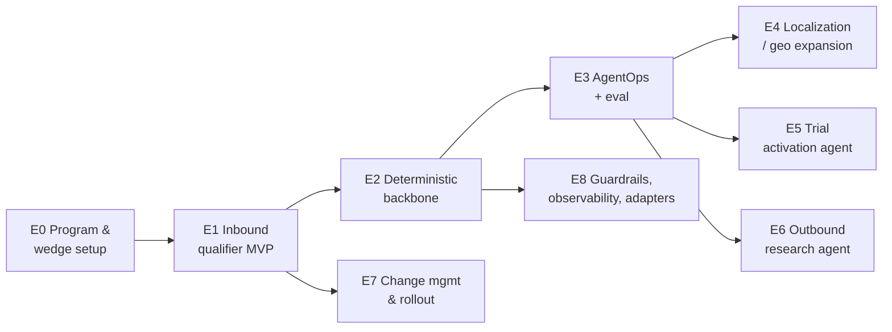

# 10 — Build Backlog (Epics & Stories)

> A ready-to-groom backlog for the Revenue Engineering squad. Stories use
> **As a … / I want … / so that …** with **acceptance criteria (AC)**, a **size** (S/M/L),
> and **dependencies**. Sequencing follows the phased rollout in
> [07 — Rollout](07-rollout-build-vs-buy-risks.md); "definition of done" metrics come from
> [06 — Metrics & Evaluation](06-metrics-and-evaluation.md).

**Legend:** Size = rough effort (S ≈ days, M ≈ 1–2 wks, L ≈ 3+ wks). `→` = depends on.

---

## Epic sequencing

---

## Epic 0 — Program & wedge setup
*Goal: a funded squad, an agreed wedge, and a measurable baseline.*

| # | Story | AC | Size |
|---|-------|----|------|
| 0.1 | As a **program lead**, I want a dedicated AI-for-GTM squad (eng + RevOps + business process owner) so that we can operate like an internal startup. | Named owners; charter; token/budget approved | S |
| 0.2 | As a **business process owner**, I want the wedge use case chosen (speed-to-lead inbound) so that we start where ROI is clearest. | Wedge documented; sponsor sign-off | S |
| 0.3 | As a **RevOps analyst**, I want the current baseline captured (response time, inbound volume, conversion) so that lift is provable later. | Baseline metrics + holdout design agreed | S |
| 0.4 | As a **RevEng**, I want a definition of "qualified meeting" (BANT) from sales so that agent objectives are unambiguous. | Written BANT criteria + escalation rules | S |

---

## Epic 1 — Inbound Qualifying & Hand-off Agent (MVP, single market)
*Goal: a working voice qualifier in one language/market, A/B vs. manual. →E0*
*(Detail: [01](01-inbound-qualifying-agent.md))*

| # | Story | AC | Size |
|---|-------|----|------|
| 1.1 | As a **RevEng**, I want the agent provisioned as a **dedicated CRM user** so that it receives assigned leads via existing routing. | Agent user created; test lead auto-assigns | S |
| 1.2 | As a **RevEng**, I want a **CTA → CRM assignment → orchestration** trigger so that submissions start the flow automatically. | 'Contact sales' submit fires orchestration <5s | M |
| 1.3 | As a **RevEng**, I want **≤60s prep workflows** (insight, timezone, local number) so that the call is context-ready. | All prep completes <60s; logged to CRM | M |
| 1.4 | As a **prospect**, I want a natural voice call that discloses AI + recording so that the interaction is trustworthy and compliant. | Disclosure + consent per market; tested opening line | M |
| 1.5 | As a **RevEng**, I want **objective-based** conversation logic (6 BANT objectives + guardrails) so that calls qualify without scripting. | Objective-completion tracked per call | L |
| 1.6 | As a **prospect**, I want low-latency responses so that the call feels human. | p50 latency 0.6–0.8s; lean KB enforced | M |
| 1.7 | As a **rep**, I want a **hand-off package** (CRM context + Slack voice memo) so that I receive a prepared meeting. | CRM notes written; Slack memo delivered | M |
| 1.8 | As a **business process owner**, I want an **A/B vs. manual outreach** so that we measure causal lift. | Holdout live; results dashboard | M |

---

## Epic 2 — Deterministic backbone ("smart tools, naive agents")
*Goal: move high-stakes steps off the LLM. →E1 (Detail: [04](04-architecture-evolution.md))*

| # | Story | AC | Size |
|---|-------|----|------|
| 2.1 | As a **RevEng**, I want a **scheduling + timezone microservice** so that live booking never hallucinates. | Timezone-correct; **0%** scheduling failures in test | L |
| 2.2 | As an **agent**, I want a **friendly-error layer** so that I get "try one of these 3 times" instead of "Error 153". | Errors mapped to actionable agent responses | M |
| 2.3 | As a **RevEng**, I want deterministic orchestration flows (e.g., n8n) wherever reasoning isn't required so that the system is reliable and fast. | ≥N high-stakes steps moved to deterministic flows | M |
| 2.4 | As a **rep/prospect**, I want dual calendar invites via the scheduler (e.g., ChiliPiper) so that meetings are booked cleanly. | Both-party invites auto-sent | S |

---

## Epic 3 — AgentOps: agents-as-code + eval harness
*Goal: treat agents as software; evaluate everything. →E2 (Detail: [06](06-metrics-and-evaluation.md))*

| # | Story | AC | Size |
|---|-------|----|------|
| 3.1 | As a **RevEng**, I want agents defined **as code** (versioned) so that changes are reviewable and reproducible. | Agent configs in VCS; PR review flow | M |
| 3.2 | As a **RevEng**, I want **templatized interaction scoring** (rubric + LLM-as-judge) so that quality is measured continuously. | Every interaction scored; human sample review | L |
| 3.3 | As a **RevEng**, I want a **golden regression set** in CI so that changes don't regress quality. | CI blocks on regression; golden cases curated | M |
| 3.4 | As a **RevEng**, I want **auditable model routing** so that we can switch LLMs without lock-in. | ≥2 models behind an adapter; routing logged | M |
| 3.5 | As a **RevEng**, I want an **autonomous iteration loop** (agents propose changes, humans approve) so that improvement compounds. | Proposed diffs + approval gate in place | L |

---

## Epic 4 — Localization / geo expansion
*Goal: go global safely. →E2, E3 (do NOT start before the backbone exists)*

| # | Story | AC | Size |
|---|-------|----|------|
| 4.1 | As a **prospect abroad**, I want **accent matching + local phone numbers** so that the call feels local. | Accent/number selected per market | M |
| 4.2 | As a **RevEng**, I want **timezone-aware callable-hours** checks so that we never call at 3am. | Calls only within permitted local hours | S |
| 4.3 | As a **compliance owner**, I want per-market **recording/consent** handling so that we stay compliant (e.g., ANZ/EMEA). | Market-specific disclosure + legal sign-off | M |

---

## Epic 5 — In-Platform Trial Activation Agent
*Goal: PLG in-app agent with safe frontend actions. →E3 (Detail: [02](02-trial-activation-agent.md))*

| # | Story | AC | Size |
|---|-------|----|------|
| 5.1 | As a **trial user**, I want an in-app avatar available live so that I can get help at any point. | Avatar shipped to a cohort + holdout | M |
| 5.2 | As the **agent**, I want **intent + potential detection** from usage signals so that I route users to the right value. | Intent score + recommended path per user | M |
| 5.3 | As a **trial user**, I want the agent to **configure my instance** for me so that I reach value faster. | ≥1 safe frontend action w/ confirm + undo | L |
| 5.4 | As a **RevEng**, I want routing to sales/PQL, self-serve, or return-nurture so that users get the optimal next step. | 3 routes live; PQL + context to CRM | M |
| 5.5 | As a **business process owner**, I want conversion measured **vs. holdout** so that lift (~2.5× target) is proven. | Holdout dashboard; return-call rate tracked | M |

---

## Epic 6 — Outbound Research & Account Planning Agent
*Goal: orchestrated research presented as one AI teammate. →E3 (Detail: [03](03-outbound-research-agent.md))*

| # | Story | AC | Size |
|---|-------|----|------|
| 6.1 | As a **rep**, I want to pick a target account and get a structured **account plan** so that I skip 1–2 weeks of research. | Plan (departments, personas, cadence, thesis) in ~minutes | L |
| 6.2 | As a **RevEng**, I want **swappable data-source modules** (enrichment, network, financials, usage) so that the pipeline degrades gracefully. | Each source modular; synthesis handles thin inputs | L |
| 6.3 | As a **rep**, I want **citations + freshness** on every claim so that I can trust and verify the plan. | Evidence + timestamps per finding | M |
| 6.4 | As a **rep**, I want plans persisted to CRM and tied to opportunities so that impact is measurable. | Plan in CRM; linked to opps created/influenced | M |
| 6.5 | As a **RevEng**, I want reps to **rate plan quality** so that ratings feed the eval loop. | Rating captured; flows into [06] harness | S |

---

## Epic 7 — Change management & rollout
*Goal: adoption and trust. →E1 (Detail: [05](05-build-lessons.md))*

| # | Story | AC | Size |
|---|-------|----|------|
| 7.1 | As a **program lead**, I want **cohort-based rollout** so that we expand gradually, not big-bang. | Cohort plan; expansion gated on metrics | S |
| 7.2 | As a **program lead**, I want **transparent performance dashboards** (wins + misses) so that trust is earned. | Shared dashboard; regular readouts | M |
| 7.3 | As a **rep**, I want **human touches** (e.g., funny voice-note summaries of booked meetings) so that the agent feels like a teammate. | Delight touch shipped; adoption tracked | S |
| 7.4 | As a **program lead**, I want **internal champions** identified so that adoption spreads organically. | Champions named per team | S |

---

## Epic 8 — Cross-cutting: guardrails, observability, adapters
*Goal: safety and swappability everywhere. →E2*

| # | Story | AC | Size |
|---|-------|----|------|
| 8.1 | As a **compliance owner**, I want **guardrail enforcement** (disclosure, statement lists, PII, escalation) so that agents stay in bounds. | Guardrail checks + violation alerts | M |
| 8.2 | As a **RevEng**, I want **vendor adapters** at every boundary so that no vendor is un-replaceable. | Telephony/LLM/scheduling/enrichment behind adapters | M |
| 8.3 | As a **RevEng**, I want **observability** (latency, reliability, disposition) so that we can operate and debug. | Dashboards + alerts live | M |
| 8.4 | As a **RevOps analyst**, I want **CRM write-back verification** so that no hand-off context is silently lost. | Reconciliation check; alert on gaps | S |

---

## Suggested first sprint (2 weeks)

- **E0.1–0.4** (setup, wedge, baseline, BANT definition)
- **E1.1–1.3** (CRM user, trigger, ≤60s prep)
- **E8.3** (basic observability) started in parallel

**Sprint goal:** a lead submitted via the CTA is auto-assigned, prepped in <60s, and logged —
ready for the voice loop in sprint 2.
